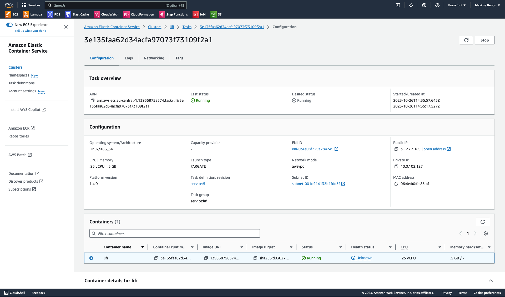
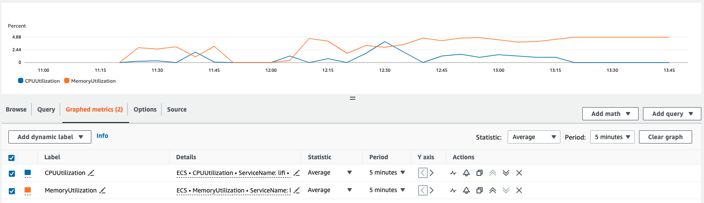

# LI.FI Coding Challenge

Welcome to my [coding challenge](https://lifi.notion.site/lifi/Senior-DevOps-Engineer-Technical-Assignment-10a07dea54304262a3fc81752abfa806) for LI.FI Senior DevOps Engineer application. Happy reading!

# Purpose

Run a nodeJS REST application in AWS.

# Functionalities

The following functionalities have been implemented:

* GET /status -> return the application status.
* GET /data -> return the data stored in DynamoDB.
* POST /data -> store the data in DynamoDB.
* DELETE /data/:id -> delete the given id data from DynamoDB.

# Technologies

The following technologies were used for this coding challenge:

* NodeJS -> part of the requirements.
* Github actions -> part of the requirements.
* Terraform -> part of the requirements.
* ECS Fargate -> I decided to use ECS Fargate to run the application. I went with this technology because it's fully serverless & managed, which reduces the TCO (Total Cost of Ownership) compared to other technologies such as EKS.
* DynamoDB -> I decided to use DynamoDB to store the application data for similar reasons, it's a managed serverless service which makes it easy to use and low maintenance. It's also very cost-efficient as I only pay when it's used.
* Cloudwatch -> I used Cloudwatch to monitor the application, as it's the logical choice when using Fargate since it's coming for free. Cloudwatch is used for metrics and application logs (a technology like Prometheus doesn't make sense in that setup).

I'm happy to discuss my technical choices in a call and be challenged!

# CICD

The CICD pipeline uses Github actions separated into two jobs:

* build -> builds the application, runs unit test and pushes the docker image to ECR.
* terraform -> inits terraform, runs a plan and applies it.

Both jobs are executed in parallel, which has a chicken-egg problem for the first deployment, as the ECR repo needs to be provisioned before the build step can push to ECR. Also, the Fargate task uses the `latest` tag for simplicity, which is unreliable and shouldn't be used in production. In a normal scenario, the expectation would be to build and push the docker image before setting up the Fargate task definition - doing it that way automatically rolls out new versions.

# Infrastructure

The infrastructure is provisioned with Terraform. For the sack of simplicity, there is only one entrypoint to deploy all components:

* ECR repo.
* Networking (VPC, subnets, route tables, IG).
* DynamoDB table.
* Fargate cluster, task definition, service and IAM role.

I used separated modules to keep different components isolated. Ideally, core infrastructure like networking shouldn't be part of this repo but set up somewhere centrally.

# Improvements

There are many improvements that would be needed before considering this application production-ready:

* Add load balancer, DNS and certificate (ALB, Route53 & ACM).
* Autoscaling of the ECS service based on some metrics to ensure enough capacity. Also having at least 2 replicas to ensure HA.
* Set up alarms and detailed monitoring.
* Add caching using AWS Redis.
* Use semantic versioning instead of `latest` or get a unique sha from the pipeline and propagate it to the Fargate task.
* Add real unit tests when the code has more logic in it.
* Update AWS SDK to v3 using `import` instead of `require`.
* Learning more about NodeJS and having a proper application structure according to best practices.

# Local development

## Application

In order to run the application locally, one must have nodeJS and NPM installed and must run the following:

```bash
npm install
node app.js
```

Versions used to build this application:

```bash
node --version
v16.15.1

npm --version
8.11.0
```

## Infrastructure

In order to deploy the infrastructure, one must have Terraform installed and AWS configured locally. Then the following can be executed:

```bash
terraform init
terraform apply
```

Terraform version used to deploy the application:

```bash
terraform --version
Terraform v1.6.2
```

# Demo

Click the following link to see a demo of the usage: [Demo](https://asciinema.org/a/iAuShd97LLAOlTsMtGNqsUpkq)

Additionally, here are some screenshots of the applications running:

## Fargate task




## Metrics


